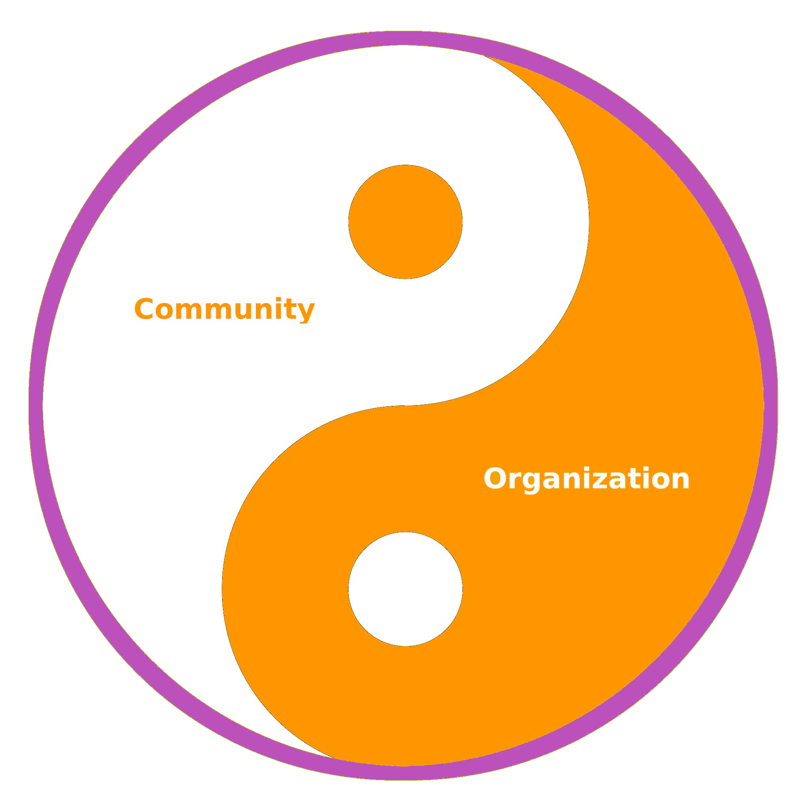

# Community and Organization

We recognize that the WiHi system is a [complex system](/fundamentals/complex.mdx) (due to its size and inter-dependencies among its components)
which can neither be controlled nor governed effectively with traditional hierarchical top-down management or control mechanisms (see [1](https://www.researchgate.net/publication/364949613_Democracy_by_Design_Perspectives_for_Digitally_Assisted_Participatory_Upgrades_of_Society), [2](https://link.springer.com/book/10.1007/978-3-030-62330-2) or [3](https://medium.com/coinmonks/complex-systems-part-2-managing-complexity-with-bottom-up-solutions-9d6fadd88cc4)). 
Hence, we chose the organizational form of a decentralized autonomous organization (DAO) that empowers community members to act (self-organization) and that
can harness the collective intelligence of the members via digital democracy to steer its system parameters and actions.

These decentralized bottom-up mechanisms rely on single actors and their relationships they form with each other (which means in the end you and your local knowledge and activity!).

Thus, for the collective intelligence and self-organization of WiHi to emerge, a large number of actors must contribute. It does not matter
whether one is an expert, hobbyist, researcher or "just" an interested observer, or what their motivation in WiHi is - all and more are needed to tackle our urgent
challenges related to the climate and weather. 

Basically, a DAO is what happens when diverse actors start to collaborate and align towards a shared vision that satisfies their personal goals ([4](https://static1.squarespace.com/static/6313a587324d1047ec4d9a13/t/64e892a5e6f5d8652a2b925b/1692963500980/20230825_whitepaper_onocoy_final.pdf)).
In an ideal case, “a sense of community brings trust and wellbeing which enable better organisation. And effective
organisation can enable value flows that sustain community.” ([5](https://twitter.com/_Daniel_Ospina/status/1648567755791122433)). In this way, communities and DAOs
can form natural symbioses, which result in powerful anti-fragile organizations capable of motivating individuals and
communities to accomplish the extraordinary, like setting up global and dense physical infrastructure
networks ([6](https://dl.acm.org/doi/abs/10.1145/3487552.3487846)).

Hence, the goal and purpose of WiHis organisation is to nurture this community and facilitate value flows among its community members.

In its very essence, WiHi is a community-owned and driven initiative.

