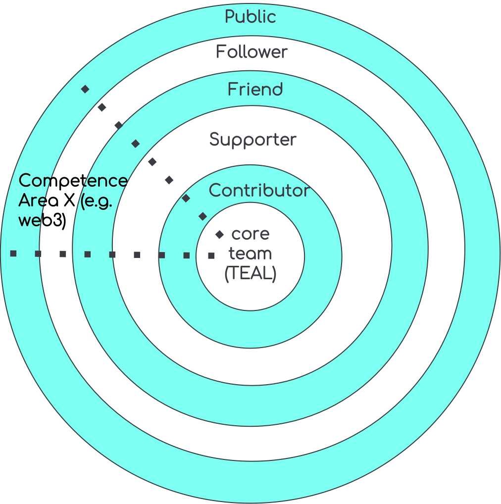

# The DAO Onion

The WiHi DAO ([introduced in WHIP-0002](https://github.com/wihi-labs/WHIP/blob/main/0002-wihi-dao/main.md)) is the organizational structure that
the WiHi community gives itself to achieve its
vision of facilitating weather and climate intelligence
 anytime and anywhere. It follows the principles of collective intelligence
 and self-organization to manage its complex 3-sided market consisting of 
 weather data providers, data consumers and platform maintainers/ developers/ forecasters.

 

 The DAO consists of 5 layers, as illustrated in the figure above. The public can join the DAO by following WiHi in one of its channels (e.g. Twitter, Discord, etc.). By starting to interact with members of upper layers in the DAO and/ or by owning WiHi tokens, a follower can become a friend of WiHi. Friends that actively start supporting WiHi by performing dedicated tasks for it success are becoming supporters of WiHi. Those supporters that spend a considerable amount of their time supporting WiHi become contributors. Contributors that take larger responsibility within the DAO can become core team members.

The core team itself is self-organized in areas of competence that radiate out into the other layers.

Due to this onion structure, members of the organization can decide freely how much time and work they want to put into WiHi, only depending
on their current interests and motivation. In particular, this organizational form allows members also to become less active again, 
while giving them the chance to re-join the inner circles of the onion as soon as their personal goals start aligning stronger with WiHi's vision again.

## Operational Rules:

1. Core team votes to add new core members or remove existing ones;
2. Any core team member can open new competence areas (CA)
3. Competence areas organize themselves
4. CAs can level up members until Contributor level (in the DAO Onion)
5. CAs can grant member access to CA specific communication channels
6. Anyone is empowered to join any CA as a follower
7. CA manage a (monthly) budget of tokens they can spend (can be 0). Either the CA receives tokens by an entity already owning tokens or requests them via an improvement proposal from the treasury.
8. CA can decide to “outsource” work on a token basis
9. Fiat compensation requires alignment within core team

## Competence areas

Competence areas (CA) can be functional or role-based and emerge from the interactions between the community members.
Functional CAs are for example "metereology", "social media", or "web3/blockchain".
Role-based competence areas are for example "experts", "ambassadors", or "builders". 
The number of competence areas an individual can be part of is not capped. 
Also, an individual can be in different layers of the onion for different CAs.
For instance, one might be a follower within the metereology CA, but be a contributor for the social media CA. 
