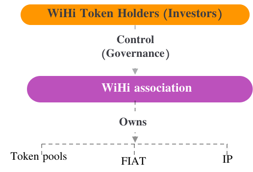

# Legal Setup

The IP-holding entity of WiHi is a not-for-profit Swiss association. This association is overseen by WiHi token holders: Members of the association are the *Members* (delegates) introduced in [WiHi's token voting](/cryptoeconomics/gov/voting.mdx) mechanism. WiHi token holders exercise control over the association's general meetings via delegating tokens to these members, which includes the election of the governance committee. The association defines the minimal acceptance criteria for members such that Sybil attacks on the voting mechanism are prevented. 

The association holds intellectual property and system funds (see Figure above).  

In summary, WiHi is a Decentralized Autonomous Association using a Swiss association as a legal wrapper to handle off-chain governance and mitigate liability risks of its members.
In particular, by controlling the association with tokens, digital and physical decision making power stems from the same source.
