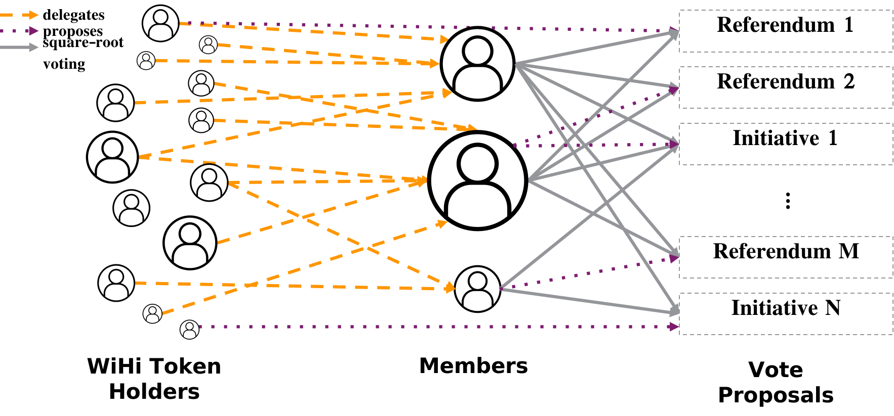

# Token voting

The figure above illustrates the voting mechanism applied in WiHi.

Community members who possess WiHi tokens can anonymously delegate their tokens to identified (partially doxed) delegates (referred to as members in the above image) within the system.

Delegates use their delegated tokens to vote on proposals, with voting power proportional to the square root of the tokens they control and those which were delegated to them (e.g., 1 token unit equals 1 vote, but 4 token units equal 2 votes, 9 tokens – 3, and so on). All community members have the opportunity to submit vote proposals.

Initially, super majority will be employed for decision-making (>66% of the voting power is required to accept a proposal), but alternative voting mechanisms will be explored in the future to better align with community sentiment and prevent the "Tyranny of the Majority."

## Rationale

The primary objective of WiHi's governance can be summarized as follows:

1. Inclusion of all stakeholders, including users, in decision-making processes.
2. Facilitation of self-improvement without centralized control.
3. Prevention of power concentration within any individual or group of stakeholders.

Identifying/ doxing delegates' is required to  
- prevent Sybil attacks on the square-root voting (fraudulent voting by distributing once own tokens to several anonymous identities)
- ensure transparency in the allocation of voting power. This transparency allows for the identification of power concentration and the implementation of mitigation strategies, such as forks.

Nevertheless, in order to facilitate broad participation and thus the taking of responsibility, the objective is to establish (minimal) criteria such that a large number of community members become delegates, promoting decentralization. 

Anonymous delegation of voting power enables broad participation in governance and ensures private reasoning, [both crucial for the emergence of collective intelligence](https://medium.com/coinmonks/complex-systems-part-2-managing-complexity-with-bottom-up-solutions-9d6fadd88cc4).

Enabling all community members to submit vote proposals support free expression and broad participation, [both crucial for the emergence of collective intelligence](https://medium.com/coinmonks/complex-systems-part-2-managing-complexity-with-bottom-up-solutions-9d6fadd88cc4).

