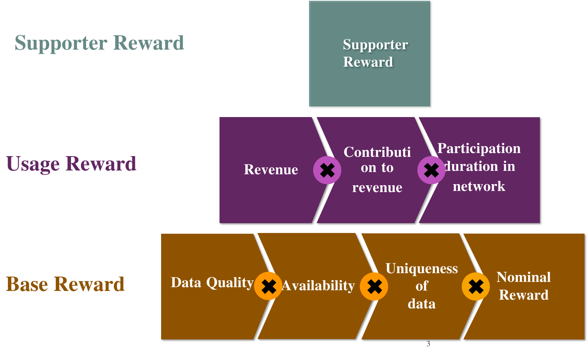

# Weather Station Operators (aka Miners)
Miners in WiHi have access to three types of rewards: i) base rewards, ii) usage rewards and) supporter rewards.

## Background

WiHi is based on an open-hardware DePIN model in comparison to most DePIN projects that are based on a closed-hardware model.

Open-hardware DePIN networks are hardware agnostic: any hardware that is not locked by the manufacturer can join the network. In contrast, closed-hardware DePIN networks only allow permissioned hardware that are typically also sold by the network itself and locked to other networks.

Beyond the obvious differences between open and closed hardware networks, one important difference between the two models is in the respective business models and how it relates to the DePIN flywheel.

In a closed-hardware DePIN network, the fundamental business model is in selling the hardware devices that comprise the network. From a purely financial point of view, tokens in a closed-hardware DePIN network are used to exchange potential future returns for fiat returns today.

Thus, a crucial point to note is that in closed-hardware models, the network is not giving away equity for nothing [in the form of tokens] with base rewards: participants pay the network in fiat for the hardware (miner). This greatly reduces the risk faced by a DePIN network: even if the participant decides to eventually leave the network once the tokens are of a sufficient value or if they cannot earn any more tokens, they have already contributed to the network during the crucial early stages by the exchange of fiat for the miner.

Hence giving an (unconditional) base reward to miners is sub-optimal in an open-hardware network such as WiHi. It still can be beneficial as it can encourage a quick network growth, which attracts publicity/ further contributors, etc. and motivates early contributors.
Nevertheless, in WiHi the situation with base rewards is further complicated as at the moment we can assess neither the quality nor the usefulness of the data contributed to us 
(though knowing that eventually WiHi will be able to assess both).

## Base Reward
Following the previous considerations, for the time being WiHi decided against a base reward for miner rewarding. 

Eventually, WiHi will utilize base rewards. As soon as the WiHi AI-forecaster is implemented, 
WiHi will be able to access the useability of data for that forecaster as a proxy for the quality of delivered data and issue base rewards accordingly.

## Usage Reward
Miners in WiHi receive a share of the revenues that are generated with their data. These revenues can stem from both, a direct sell of the data or a utilization of the data in forecasts that are provided to end-customers.

There are currently no revenues in the WiHi network and therefore no usage rewards. 
Nevertheless, station operators are already being encouraged to share data now, because an important factor within the usage reward is the **length of time a miner has contributed data** to the WiHi network - the longer, the better - starting already from now.
The contributions are verifiable logged on-chain.   

## Supporter Reward
Vocal, active and/ or influential station operators have very low requirements
to join one of our supporter programs and obtain rewards associated with those activities. 
These are illustrated in the next section. 
