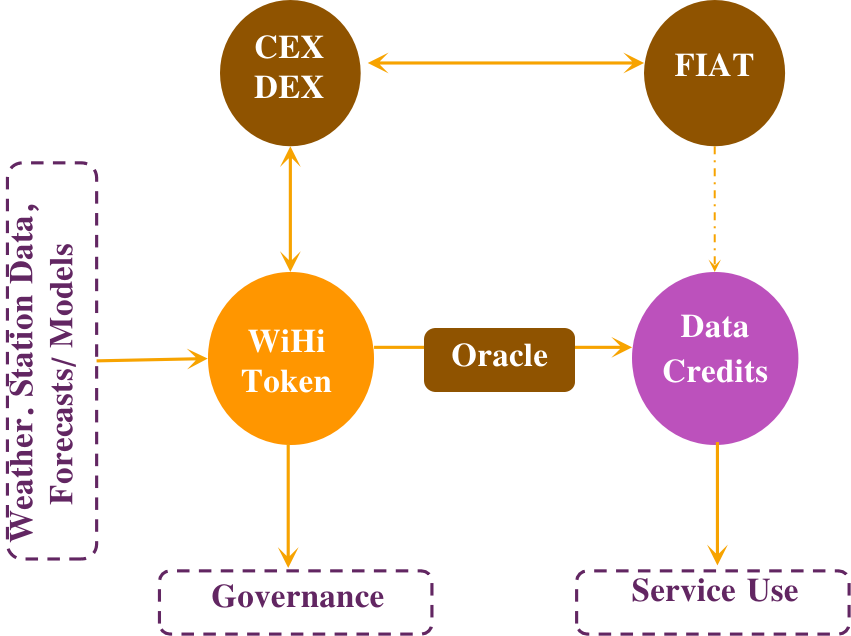
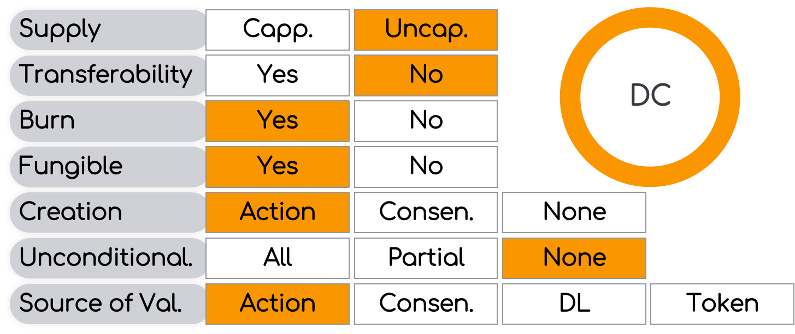
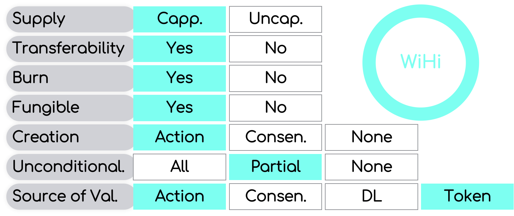

# Token Model

WiHi follows DePIN industry best practice by using a deflationary burn-and-mint token model. 

## WiHi Token

The WiHi token is awarded to weather and climate data providers (miners)  and forecasters in exchange for the data and forecasts provided to the platform. The WiHi token gives access to the systems [governance](/cryptoeconomics/gov/voting.mdx) and the services on the platform. The latter is achieved by letting the exchange of WiHi tokens for data credits be the only means to receive credits in the system, which in turn gives access to the system services. The exchange is performed via an oracle in such a way that the data credits have a fixed price denominated in a FIAT currency (e.g. US Dollar). 
Hence, end customers who want to access system services will have FIAT-fixed prices, independent of value movements in the WiHi token.

## Data Credits

Data credits are an uncapped non-transferable token that are burned whenever they are used to access system services.

## WiHi Token

In contrast to the data credits, the WiHi token is freely tradeable at exchanges and thus can be converted to a FIAT currency such as US Dollar. It is capped in supply, is (partially) burned when exchanged for credits, and its creation is bound to performing weather/ climate data sharing and forecasting actions in the system. The token has value because it gives access to governance and is the only means to access the services of the system.