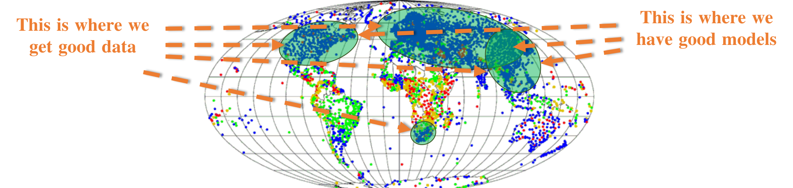
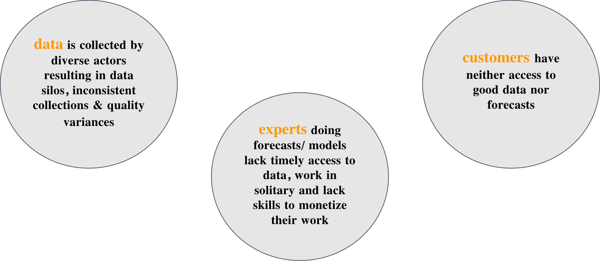

# Why WiHi matters
 

## The macro perspective
Extreme weather events are on the rise. [In 2022, alone the U.S. witnessed](https://www.youtube.com/watch?v=Q5rgua9eOuY) 18 major weather or climate disasters,
marking a significant year in terms of the intensity and frequency of such events. 
These disasters led to tragic losses, both in human lives (at least 474 fatalities) and financially, with damages|
soaring to $165 billion.

This is a global phenomenon resulting from a changing climate, leaving many regions of the world exposed to high climate stress and variability.
In particular regions with lower adaptive capacity such as Africa are vulnerable to it. 
[The State of Climate in Africa 2022 report](https://library.wmo.int/viewer/67761/#page=1&viewer=picture&o=bookmark&n=0&q=) illustrates the severe damage of climate change in Africa: 
Floods ravaged Central, Western and East Africa affecting the lives of over 1 million people. 
The tropical storms and cyclones that hit Southern Africa affected over 2.5 million people, resulting 
in the death of more than 600 people. And the northern part of Africa experienced disasters associated with extreme temperature anomalies, 
from the heatwaves and wildfires that raged in Tunisia, Morocco, and Algeria to the heavy rainfall, snow, 
and sandstorms that plagued Libya

In light of these extreme weather events, the role of accurate and timely weather and seasonal forecasting has never been more critical.
This is reflected by, for instnace, the substantial growth of the U.S. weather forecasting services industry, valued at $17.4 billion in 2023.

Historically, weather forecasting was characterized by cooperation among public sector entities among nations.
Nevertheless, the realm of weather forecasting is no longer exclusive to government agencies.
Private companies are increasingly prominent, offering specialized, hyperlocal weather services. 
However, this shift raises questions about accessibility. While NOAA issues 1.5 million forecasts and 50,000 
warnings annually as a public good, private services come at a substantial cost, ranging from [$20,000 to millions of dollars annually](https://www.youtube.com/watch?v=Q5rgua9eOuY).
 
 

## The micro perspective

Besides the illustrated macro challenges humanity is facing when it comes to weather anc climate, the current 
existing weather & climate forecasting ecosystem is challenged by a range of problems that prevent accuracte and cost-efficient
weather and climate intelligence:

- **Challenge 1: Sparse data and models:**
Forecasting depends on two things: a) good data and b) good models. 
Nevertheless, at the moment these are restricted to a few regions, leaving out regions such as Africa or South America,

- **Challenge 2: Siloed data**
In regions where data & models are dense, they are siloed resulting in low accessibility & higher cost.

- **Challenge 3: Varying Quality**
Hobbyist communities, private entities and governmental organizations contribute data sets & forecasts of varying quality.

- **Challenge 4: Misaligned incentives**
Experts, governmental organizations and hobbyists lack expertise to be fairly rewarded which has a negative impact on both,
the consistency and quality of weather data collection, but also the effort put into improving weather and climate forecasting. 

## Challenges arise from missing links

In summary, what can be observed is that a link between weather data contributors, experts providing forecasts and consumers of weather data and forecasts is missing.
