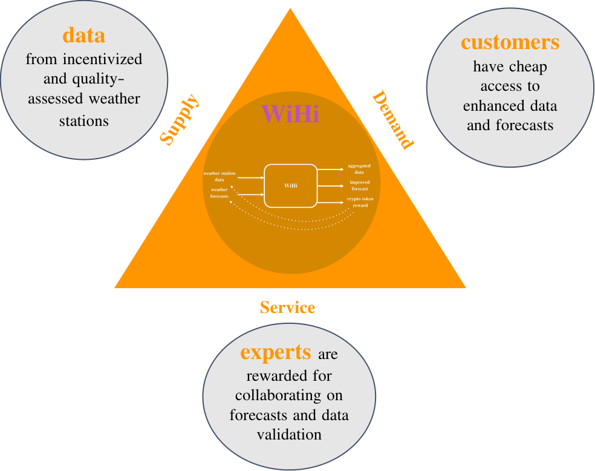

# The plan: Facilitating and leveraging the weather communities collective intelligence 
WiHi creates a platform on which weather data contributors, forecasting experts and consumers come together in form of a three-sided market.

**Weather station operators** are rewarded for sharing data which quality is assessed by **WiHi's expert community** which additionally uses the data
and their own modeling expertise to provide enhanced forecasts to **customers** who in turn can access these enhanced forecasts and data in a cost effective way.

## WiHi's vision: Incentivizing data sharing and forecasting collaboration

WiHi uses cryptoeconomics to coordinate the complex weather and climate community such that enhanced forecasts and data are delivered cost-effectively to customers:

- **Participatory governance:** Those contributing, maintaining and using the platform are those who own and control it. 
- **Fair rewards:** Incentives are use for both, weather station operators and forecasting experts to contribute to the platform. By using token incentives to decentralize the contributions, the capital expenditures and operational costs usually associated with maintaining large cross-boarder infrastructures and communities are reduced significantly, in particular when compared to hierarchical organizations.
- **Trustworthy storage and interactions:**

Eventually, based on these mechanisms a global and dense network of weather stations will emerge that shares high-quality data.
This data will be used by a diverse community of weather and climate experts to perform forecasts.
These different forecasting experts will compete in a playful manner with each other and commit their predictions to the platform.
WiHi will aggregate these predictions of the weather community for its forecasting. Such an aggregation will improve the quality of the single forecasts: It is known from the Netflix challenge (https://en.wikipedia.org/wiki/Netflix_Prize) that aggregating superior forecasts with inferior forecasts will improve those superior forecasts significantly. A phenomenon called collective intelligence in the complexity sciences (https://medium.com/coinmonks/complex-systems-part-2-managing-complexity-with-bottom-up-solutions-9d6fadd88cc4)

