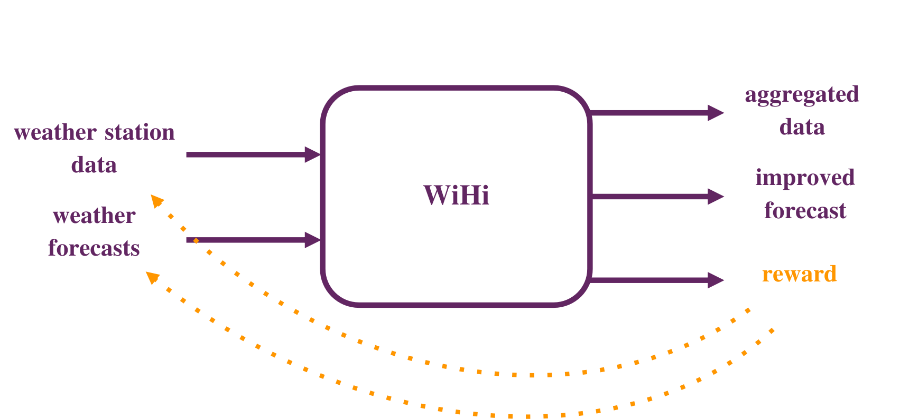
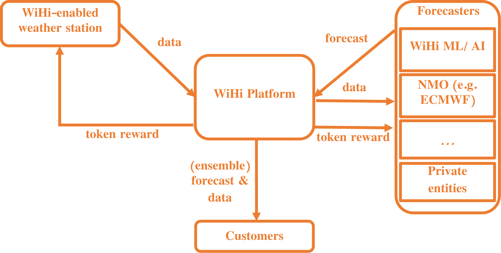

# The plan: Facilitating and leveraging the weather community's collective intelligence
WiHi is creating a platform on which weather data contributors, forecasting experts and consumers come together in form of a three-sided market.

**Weather station operators** are rewarded for sharing data which quality is assessed by **WiHi's expert community** which additionally uses the data
and their own modeling expertise to provide enhanced forecasts to **customers** who in turn can access these enhanced forecasts and data in a cost effective way.

## WiHi's vision: Incentivizing both data sharing and collaborative forecasting

WiHi uses [cryptoeconomics](/cryptoeconomics) to coordinate the complex system of weather and climate communities such that enhanced forecasts and data are delivered cost-effectively to customers:

- **Participatory governance:** Those contributing, maintaining and using the platform are those who own and control it, ultimatively guaranteeing an equitable access facilitating the collective intelligence and self-organization of the WiHi platform.
In particular, new voting mechanisms make it possible to prevent concentrations of power and lower the threshold for participation.
- **Fair rewards:** Incentives are used for both, weather station operators and forecasting experts to contribute to the platform. By using blockchain-based token incentives to decentralize the contributions, the capital expenditures and operational costs usually associated with maintaining large cross-boarder infrastructures and communities are reduced significantly, in particular when compared to hierarchical organizations.
- **Trustworthy storage and interactions:** Potentially mistrusting parties can varify the fairness of the mechanisms defining interactions on the WiHi platform, and hence can start collaborating and reach consensus. In particular, contributions in data and services and access to those
are logged transparently and immmutably and determine the revenue sharing, while transparent mechanisms are in place guaranteeing data quality, fair access and decentralized control.

Eventually, based on these mechanisms a global and dense network of weather stations emerges that shares high-quality data.
This data is used by a diverse community of weather and climate experts to perform forecasts.
These different forecasting experts compete in a playful manner with each other and commit their predictions to the platform, each honest contribution is rewarded.
WiHi then aggregates these predictions of the weather community for its own forecasting. Such an aggregation improves the quality of the single committed forecasts: It is known from the [Netflix challenge](https://en.wikipedia.org/wiki/Netflix_Prize) that aggregating superior forecasts with inferior forecasts will improve those superior forecasts significantly. A phenomenon called [collective intelligence in the complexity sciences](https://medium.com/coinmonks/complex-systems-part-2-managing-complexity-with-bottom-up-solutions-9d6fadd88cc4). 

**In fact, WiHi unleashes and leverages the weather community's collective intelligence!**

