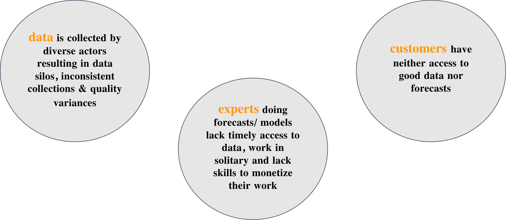

# Why WiHi matters
 

## The macro perspective
Extreme weather events are on the rise. [In 2022 the U.S. alone witnessed](https://www.youtube.com/watch?v=Q5rgua9eOuY) 18 major weather disasters,
marking a significant year in terms of the intensity and frequency of such events. 
These disasters led to tragic losses, both in human lives (at least 474 fatalities) and financially, with damages
soaring to $165 billion.

This is not a local phenomenon, but a global challenge resulting from a changing climate, leaving many regions of the world exposed to climate stress and variability.
In particular, regions like Africa with low adaptive capacity are ulnerable to climate change. The [2022 State of Climate in Africa report](https://library.wmo.int/viewer/67761/#page=1&viewer=picture&o=bookmark&n=0&q=) shows its impact: floods in Central, Western, and East Africa affected over 1 million people; storms and cyclones in Southern Africa impacted 2.5 million, causing 600 deaths; and Northern Africa faced extreme temperature anomalies, with heatwaves, wildfires in Tunisia, Morocco, Algeria, and severe weather events in Libya with snowfall.

In light of these extreme weather events, the role of accurate and timely weather and seasonal forecasting has never been more critical.
This is reflected by, for instnace, the substantial growth of the U.S. weather forecasting services industry, valued at $17.4 billion in 2023.

Historically, weather forecasting was characterized by cooperation among public sector entities and nations.
Nevertheless, the realm of weather forecasting is no longer exclusive to government agencies.
Private companies are increasingly prominent, offering specialized, hyperlocal weather services. 
However, this shift raises questions about accessibility. While NOAA issues 1.5 million forecasts and 50,000 
warnings annually as a public good, private services come at a substantial cost, ranging from [$20,000 to millions of dollars annually](https://www.youtube.com/watch?v=Q5rgua9eOuY).
 
 

## Why WiHi - The micro perspective

In addition to the outlined macroeconomic challenges facing humanity in relation to weather and climate, the current weather and climate forecasting ecosystem is challenged by a number of issues that prevent accurate and cost-effective weather and climate intelligence that would improve people's lives:

- **Challenge 1: Sparse data and models:**
Forecasting depends on two things: a) good data and b) good models. 
Nevertheless, at the moment these are restricted to a few regions, missing regions such as Africa or South America

- **Challenge 2: Siloed data**
In regions where data & models are dense, they are siloed resulting in low accessibility & higher cost.

- **Challenge 3: Varying Quality**
Hobbyist communities, private entities and governmental organizations contribute data sets & forecasts of varying quality.

- **Challenge 4: Misaligned incentives**
Experts, governmental organizations and hobbyists lack expertise to be fairly rewarded which has a negative impact on both,
the consistency and quality of weather data collection, but also the effort put into improving weather and climate forecasting. 

## These Challenges arise from a missing link

In summary, what can be observed is that a link between weather data contributors, experts providing forecasts and consumers of weather data and forecasts is missing.
