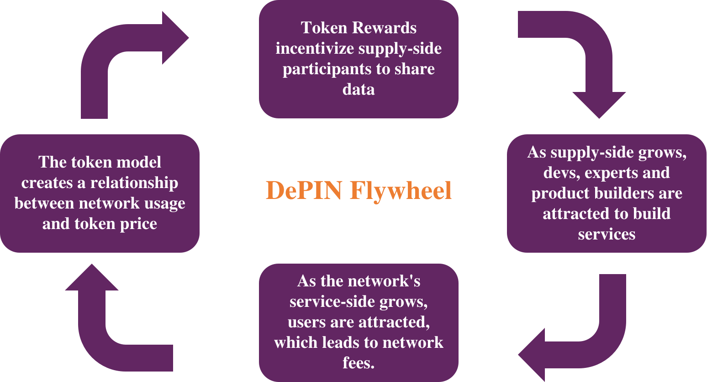

# Starting with crowedsourced data and AI
Decentralized physical infrastructure networks such as WiHi exhibit exponential growth when positive and reinforcing feedback loops are closed in their network, as shown in the flywheel below:

Growth of weather stations through incentives attracts experts and developers who build services on WiHi, which in turn attracts end users, who in turn generate fees. The fees are linked to rewards via a token model that incentivizes more stations and experts to join the network. This process continues and intensifies.

Because of that [DePINs exhibit a chicken-egg problem when kickstarting their three sided market](https://medium.com/wihi-weather/depins-are-three-sided-markets-an-evaluation-guide-for-investors-to-access-decentralized-8f82273c8d02):
Without end users, token rewards have only speculative value, so convincing stations to join the network is a challenge. But without stations, no services are built in the first place.
In general, an iterative approach is required, usually starting with station onboarding and then developing initial services based on the data collected.

At WiHi, in order to kick-off this flywheel, we decided to start crowedsourcing data from stations from communities that do not require token incentives in the beginning of the network (e.g. weather hobbyists, metereological organizations and citizen science initiatives) and to promise
those a [usage reward](/cryptoeconomics/tok/rewards/miners) as soon as their data is used (dashed line in the above image).
On top of this collected data, WiHi is building an AI-based forecaster as a first service. This forecaster service alongside WiHi data is made available to customers, creating revenues that incentivizes station build-out.
In this way, the WiHi AI-forecaster is the first party that contributes to WiHi's forecaster collective intelligence, as introduced in the [previous section](/intro/plan.mdx). 

