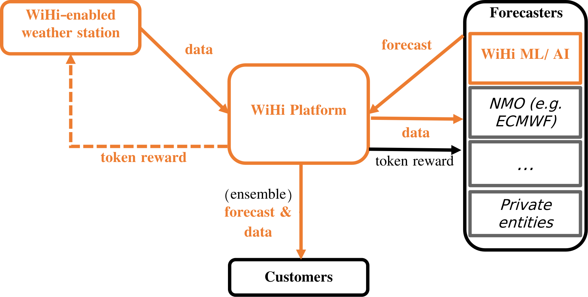

# Starting with crowedsourced data and AI
(Decentralized physical infrastructure networks such as WiHi exhibit an exponential growth when positive feedback loops are closed, as illustrated in the following flywheel:

A growth of weather stations through incentivization attracts experts and devlopers to build services on WiHi, which in turn will attract end users,
which in turn generates fees that. The fees are connected
to the rewards that incentivize further stations and experts to join the network. This process continues and amplifies.

Because of that [DePINs exhibit a chicken-egg problem when kickstarting their three sided market](https://medium.com/wihi-weather/depins-are-three-sided-markets-an-evaluation-guide-for-investors-to-access-decentralized-8f82273c8d02):
Without end-users, token rewards have only speculative value. Nevertheless, without stations in the first place, no services can be build.
In general, an iterative approach is required, usually starting with station onboarding and then building first services on the collected data.

At WiHi, in order to kick-off this flywheel, we decided to start crowedsourcing data from stations from communities that do not require token incentives in the beginning of the network (e.g. weather hobbyists, metereological organizations and citizen science initiatives) and to promise
those a [usage reward](/cryptoeconomics/tok/rewards) as soon as their data is used.
On top of this collected data, WiHi is building an AI-based forecaster as a first service. This forecaster service alongside WiHi data is made available to customers, creating revenues that incentivizes station build-out.
In this way, the WiHi AI-forecaster is the first party that contributes to WiHi's forecaster collective intelligence, as illustrated in the previous section. 

